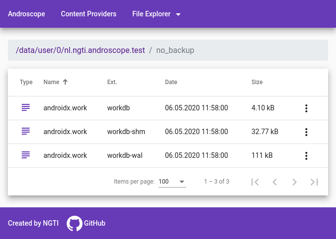
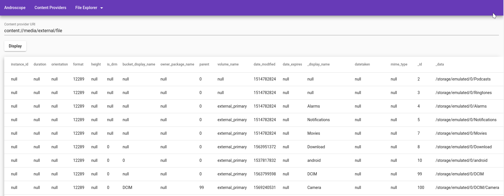
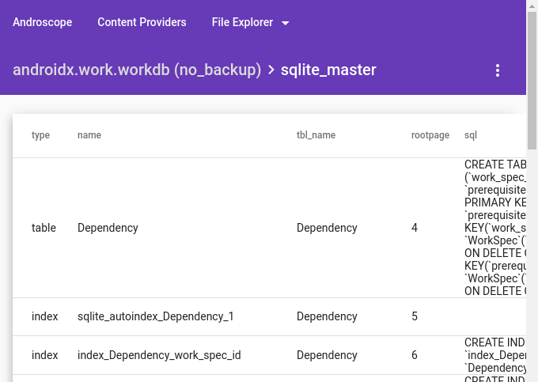

# Androscope

[](https://search.maven.org/search?q=g:%22nl.ngti%22%20AND%20a:%22androscope%22)

Androscope is a debugging tool that allows to see the internals of your Android application and device. Some of this data is still not possible to see using standard debug tools, or it is not very convenient (you need to use ADB), or they require certain dependencies (like Chrome Developer Tools for Stetho). Androscope runs in any browser, even on the mobile device where your application is running.

[Features](#features)

[Setup](#setup)

[Recipes](#recipes)

- [Best practices](#best-practices)
- [Customize Androscope activity name](#customize-androscope-activity-name)
- [Auto-start Androscope](#auto-start-androscope)
- [Set a fixed port](#set-a-fixed-port)
- [Configure your database](#configure-your-database)
- [Configure image cache](#configure-image-cache)
- [View BLOB database data](#view-blob-database-data)
- [Customize Androscope process](#customize-androscope-process)

[Contribute](#contribute)

## Features
1. View file system of your application and other device folders.



2. View data from content providers that are accessible to your application. It includes of course all public system content providers, like Contacts or MediaStore, but they might require your application to ask for corresponding permissions.



3. View content of application databases, see SQL code of any database object or execute custom queries, also to modify your database structure or data.



4. Download and upload databases.
5. View caches of image libraries, like Glide, Coil, Picasso.

On top of that, Androscope is very efficient. Displayed data is cached and paginated, so you are not going to experience any freezes while viewing content. You can also adjust sorting in tables.

## Setup

Androscope supports Android applications with minimum API level 16.

Add Androscope dependency to your Gradle script:

```
debugImplementation 'nl.ngti:androscope:1.0-RC4'
```

Install your application and you will see the entry named **Androscope** in launcher. Run it to launch the web server and then you can start using Androscope in a web browser.

No configuration in code is required, but you might want to do some customizations (see [Recipes](#recipes)).

**Note:** if your application crashes when attempting to launch Androscope because of some initialization in Application class, you can [force Androscope to run in the main process](#customize-androscope-process).

It is a good idea to put Androscope only for debug build type or for a specific flavor, so you don't use it in production builds.

## Recipes

Androscope runs out of the box. But if you use Androscope regularly you might want to configure its activity name or in certain cases you might need to configure your custom database or adjust the port Androscope is running at, or make its web server start automatically with the application.

You might need to add additional configuration to the manifest of your application or customize string resources.

### Best practices

It is a good idea to do these customizations in a build type or a flavor to which Androscope dependency is added, so you don't mess up your production manifest. You can do this by adding manifest or string resource file into a custom [source set](https://developer.android.com/studio/build#sourcesets).

### Customize Androscope activity name
Customize a string resource `androscope_activity_label`:

```xml
<?xml version="1.0" encoding="utf-8"?>
<resources>
    <string name="androscope_activity_label" translatable="false">MyApp Androscope</string>
</resources>
```

### Auto-start Androscope
By default you need to open Androscope activity in order to start it. If you want Androscope to start automatically every time you run the application, add the following configuration into the manifest:

```xml
<?xml version="1.0" encoding="utf-8"?>
<manifest xmlns:android="http://schemas.android.com/apk/res/android">

    <application>
        <meta-data
            android:name="nl.ngti.androscope.AUTO_START"
            android:value="true" />
    </application>
</manifest>
```

### Set a fixed port
By default Androscope tries to automatically choose a free port in a range within `8787..10000`. If you want to be able to bookmark Androscope links for specific applications, you need to assign a fixed port:

```xml
<?xml version="1.0" encoding="utf-8"?>
<manifest xmlns:android="http://schemas.android.com/apk/res/android">

    <application>
        <meta-data
            android:name="nl.ngti.androscope.HTTP_PORT"
            android:value="87910" />
    </application>
</manifest>
```

In this case Androscope will fail to start when the specified port is occupied.

### Configure your database
In Androscope you can see all databases returned by [Context.databaseList()](https://developer.android.com/reference/android/content/Context#databaseList()) method. However, you might have databases in `no_backup` folder to avoid them being automatically backed up by Android. In this case to see your database in Androscope you will need to add a custom manifest configuration:

```xml
<?xml version="1.0" encoding="utf-8"?>
<manifest xmlns:android="http://schemas.android.com/apk/res/android">

    <application>
        <meta-data
            android:name="nl.ngti.androscope.DATABASE_NAME"
            android:value="no_backup://my_database.db" />
    </application>
</manifest>
```

**Note:** `no_backup` folders are supported since API 21 (Lollipop).

This feature is also convenient if you want to make your database be displayed always on top of the list. If it is located in the standard database location, you need to specify just the database name:

```xml
<meta-data
    android:name="nl.ngti.androscope.DATABASE_NAME"
    android:value="my_database.db" />
```

### Configure image cache
Androscope is able to detect by default default cache locations of [Picasso](https://square.github.io/picasso/), [Glide](https://github.com/bumptech/glide) and [Coil](https://github.com/coil-kt/coil) image libraries. If you use another image library or a custom location for your image cache - you need to tell Androscope where it is located and how can it filter out only images:

```xml
<?xml version="1.0" encoding="utf-8"?>
<manifest xmlns:android="http://schemas.android.com/apk/res/android">

    <application>
        <meta-data
            android:name="nl.ngti.androscope.IMAGE_CACHE"
            android:value="image_manager_disk_cache" />
        <meta-data
            android:name="nl.ngti.androscope.IMAGE_CACHE.filter"
            android:value="^.*\\.0$" />
    </application>
</manifest>
```

- `nl.ngti.androscope.IMAGE_CACHE` option configures the folder where the cache is located. It should be a relative path in the application `cache` folder.

- `nl.ngti.androscope.IMAGE_CACHE.filter` is a regular expression for filenames inside the image cache folder. It should be able to filter only image files.


### View BLOB database data
[BLOB](https://www.sqlite.org/datatype3.html) values are not displayed by Androscope, because the data contained in blob might be too large or might be binary - only database creator knows that. If you still want to view your BLOB data in Androscope, you can see it using **Custom query** feature:

```sql
SELECT 
    CAST(my_blob_column AS TEXT)
FROM my_table_containing_blobs
```

### Customize Androscope process
Androscope runs by default in a separate process. This is convenient, so it doesn't interfere with the code of your main application. Also it is useful for debugging, because if the main or some other process crash, you can look what kind of data could have lead to it. If your application has issues with multiple processes, you can force Androscope to run in the main process:

```xml
<resources>
    <string name="androscope_process" />
</resources>
```

You can also customize the process name:

```xml
<resources>
    <string name="androscope_process">:debug</string>
</resources>
```
